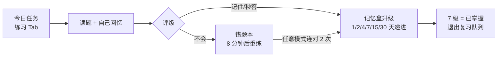
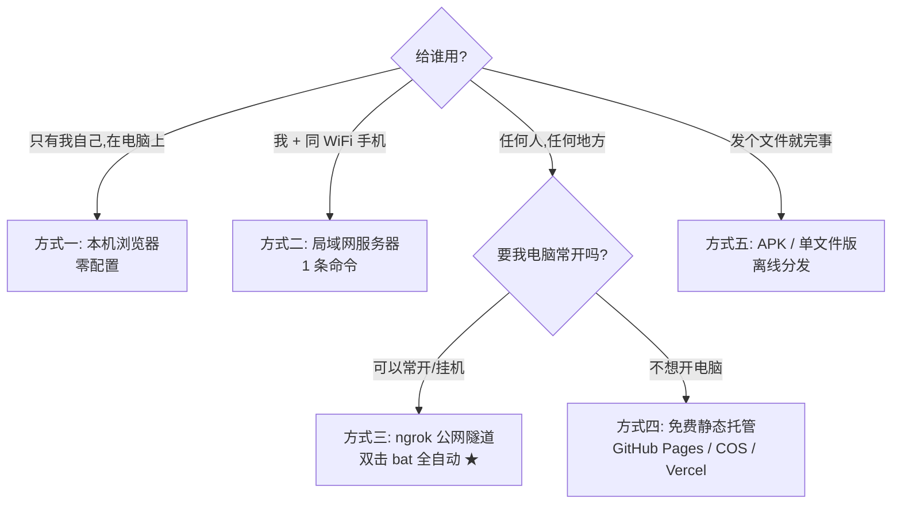

# 考途 · 求职面试与考研学习工具

> **离线优先的 PWA 学习 App**：五大赛道 + 间隔重复记忆算法 + 错题本 + 背诵模式 + 学习统计 + 数学公式渲染。
> 内置 **274 道精编题**（求职面试 125 / 考研数学 36 / 考研英语 56 / CET-6 30 / CET-4 27），
> 联网一键扩充至 **4200+ 道**（四六级/考研完整词书 3954 词，由采集器合并下发）。
> 零依赖、零构建框架、无后端、无 CDN —— 双击即用，也能打包成 Android APK 或装到手机桌面当原生 App。


---

## 目录

- **[第一部分：使用指南](#第一部分使用指南我要用这个-app-学习)** —— 我要用这个 App 学习
- **[第二部分：部署指南](#第二部分部署指南)** —— 我要在自己电脑上跑起来 / 分享给别人用
- **[第三部分：打包与分发](#第三部分打包与分发)** —— 改了代码或题库后重建 APK / 单文件版
- **[第四部分：扩充题库](#第四部分扩充题库)** —— 加题的四种方式
- **[第五部分：项目文档](#第五部分项目文档)** —— 目录结构 / 记忆算法 / FAQ / 技术要点

---

# 第一部分：使用指南（我要用这个 App 学习）

## 1.1 我该用哪种方式打开 App？

按场景对号入座，**三选一**：

| 你是谁 | 推荐方式 | 一句话步骤 |
| --- | --- | --- |
| 只想在自己电脑上用 | 本机浏览器 | 双击 `index.html`（或 `python tools/serve.py`） |
| 安卓手机，想要桌面图标 | **APK 安装包** ★ | 把 `dist/考途.apk` 发到手机，点击安装 |
| 任何手机，不想装任何东西 | **单文件版** ★ | 把 `dist/考途-单文件版.html` 发到手机，浏览器打开 |
| 想分享给同学长期用（热更新题库） | 部署服务器 | 见[第二部分](#第二部分部署指南) |

> APK（300KB）和单文件版（641KB）是 `dist/` 里的**现成产物**，直接拿走用；
> 改题库/代码后跑一句 `python tools/release.py` 重建（见[第三部分](#第三部分打包与分发)）。

## 1.2 第一次打开：三步开始学习

1. **选赛道** —— 首页顶部横向标签：求职面试 / 考研数学 / 考研英语 / CET-6 / CET-4，点一个。
   各赛道进度**独立统计**，之后随时可切。
2. **挑分类** —— 点「知识分类」宫格里任意卡片（如 Java 基础 15 题），进题目列表。
3. **开始学** —— 点任意题目进阅读页：
   - 先**自己回忆**一遍答案，再点「我已经想过了，展开答案」；
   - 读完按诚实程度点底部评级：**不会 / 模糊 / 记住 / 秒答**；
   - 评完自动跳下一题；左上角返回一次直达列表（连续翻题不会堆积返回历史）。

## 1.3 核心功能怎么用

### 学习闭环（每天这样用）



| 功能 | 入口 | 用法要点 |
| --- | --- | --- |
| **今日任务** | 底部「练习」Tab | 每天 N 题（目标在「我的」可调 5/10/15/20/30），到期复习优先；评完级红点自动消 |
| **刷题（顺序读）** | 分类页「按当前筛选刷题」 | 支持按状态/频率筛选 + 排序，评级即打卡 |
| **自测出分** | 首页快捷入口 / 分类页「自测 10 题」 | 盲答自评出分，「不会」自动进错题本，结束给针对性建议 |
| **背诵模式** | 首页「背诵模式」/ 分类页「背诵」 | 翻卡片练口述——面试是说出来，不是认出来；「不会」的卡自动回本轮末尾 |
| **错题本** | 首页 /「我的」 | 评「不会」自动进；连对 2 次自动移出；可一键抽错题重做 |
| **笔记** | 题目页「写笔记」 | 每题 Markdown 私货；「我的 → 我的笔记」一键导出含标准答案的面经 |
| **收藏** | 题目页星标（快捷键 `F`） | 面试前只过收藏；可导出 Markdown 精选 |
| **全局搜索** | 「我的 → 全局搜索」 | 题干+答案+标签全文检索，多关键词 AND，命中高亮 |
| **标签地图** | 首页「知识分类」右侧按钮 | 按标签聚合（如 #HashMap），点标签直达同款题 |
| **学习统计** | 「我的 → 学习统计」 | 18 周热力图 + 分类掌握度雷达 + 按频率的掌握率 |
| **数据备份** | 「我的 → 数据与备份」 | 导出/导入进度 JSON、导出全量 Markdown 手册 |

### 阅读增强

- 长答案自动生成**本节目录**，点条目平滑滚动定位；
- **数学公式**：`$...$` 行内、`$$...$$` 块级（分数/根号/上下标/∑∫lim/矩阵/cases 全支持，考研数学赛道大量使用）；
- **代码块**带语言标注，右上角一键复制；
- 答案里的 `[[java-004]]` 渲染成蓝色**跳题链接**，配合「关联推荐」顺着知识网刷。

### 词卡背单词（四六级/考研词书分类专用）

单词类分类自动进入**词卡极简模式**：大单词标题 + 音标释义 + 常考搭配 + 真题语境 + 同义替换 + 记忆法，答案默认展开、评级按钮加大——为「一天背一百个词」的节奏设计。评级同样进记忆曲线，背单词和学习记录完全打通。

### 快捷键（桌面浏览器）

| 键 | 作用 |
| --- | --- |
| `空格` | 展开 / 收起答案（阅读页）；翻面（背诵模式） |
| `F` | 收藏当前题 |
| `→` / `←` | 下一题 / 上一题 |
| `Esc` | 关闭弹层 |

## 1.4 个性化设置（「我的」页）

| 设置 | 选项 | 建议 |
| --- | --- | --- |
| 主题 | 跟随系统 / 浅色 / 深色 | — |
| 字号 | 90% ~ 135% 滑杆 | — |
| 每日目标 | 5 / 10 / 15 / 20 / 30 题 | 新手从 10 题起 |
| 答案默认折叠 | 开 / 关 | **强烈建议开**——先想再看是记忆算法有效的前提 |
| 评级后自动下一题 | 开 / 关 | 连刷更顺手 |

## 1.5 一键下载完整题库（4200+ 题）

App 内置 274 道精编题保证离线可用。若能访问部署好的服务器（见第二部分）：

1. 「我的」→ **一键下载在线题库** → 「立即从服务器下载」；
2. 几秒后提示「🎉 题库已更新到版本 xxx（4228 题）」；
3. 完整词书分类出现在对应赛道下（如 CET-4 赛道的「四级核心词·词卡」1162 词、「四级核心词·真题单选」132 题）；
4. 之后离线照常学；**学习进度永不被下载覆盖**。

> APK / 单文件版已内置默认公网地址，域名没变就零配置；变了就在下载卡的地址栏改一次。

## 1.6 数据安全说明

- 全部数据（进度/错题/收藏/笔记/设置）只存**你设备的 localStorage**（键前缀 `bagutong.*`）；
- App 唯一的联网行为是你主动「下载题库」，**永不上传任何数据**；
- 清浏览器站点数据会丢进度 → 重要阶段建议每周在「数据与备份」导出一次；
- 换机：导出 JSON → 新设备导入，同题以更近记录为准，不会覆盖新进度。

---

# 第二部分：部署指南

## 2.0 部署方式怎么选



| 方式 | 成本 | 手机可用 | 异地可用 | 题库热更新 | 适合 |
| --- | --- | --- | --- | --- | --- |
| 一：本机浏览器 | 0 | ✗ | ✗ | — | 只在电脑上用 |
| 二：局域网服务器 | 0 | ✓ 同 Wi-Fi | ✗ | ✓ 改 JSON 即生效 | **自用主力推荐** |
| 三：ngrok 隧道 | 0 免费额度 | ✓ | ✓ | ✓ | **个人分享推荐** |
| 四：静态托管 | 0 | ✓ | ✓ | ✓ 重传 2 个文件 | 长期稳定分享 |
| 五：APK / 单文件 | 0 | ✓ | ✓ | 仅内置+已下载 | 离线分发 |

## 2.1 环境要求

| 角色 | 需要什么 |
| --- | --- |
| **学习者**（用 App 的人） | 什么都不用装：浏览器 或 APK |
| **部署方**（跑服务器的人） | Python 3.8+（标准库即可，**无第三方依赖**） |
| 公网隧道（方式三）加要 | 免费 [ngrok](https://dashboard.ngrok.com) 账号的 authtoken |
| 打包 APK（第三部分）才要 | JDK 17+ 与 Android SDK build-tools |

Windows / macOS / Linux 均可部署。

## 2.2 方式一：本机直接用（零部署）

```bash
# 选项 A：双击 index.html（最省事；file:// 下无 SW 缓存，功能不受影响）

# 选项 B：本地服务器（推荐——可安装为桌面 PWA）
python tools/serve.py            # 默认 8080 端口，自动打开浏览器
python tools/serve.py 9000       # 换端口
```

浏览器打开 `http://localhost:8080` 后：

- **Windows Chrome/Edge**：地址栏右侧出现 ⊕ 安装图标 → 点击「安装」→ 得到独立窗口 + 桌面/任务栏图标，等同原生 App；
- **iPhone Safari**：分享 → 「添加到主屏幕」。

## 2.3 方式二：局域网服务器（手机同 Wi-Fi 直接用）★ 自用推荐

```bash
python tools/serve.py
```

启动横幅会打印三种地址，把**局域网地址**给手机：

```text
本机访问：http://localhost:8080
局域网：  http://10.0.214.221:8080   ← 手机同一 Wi-Fi 下用浏览器打开这个
```

安装到手机桌面：

| 手机 | 步骤 |
| --- | --- |
| Android（Chrome） | 打开局域网地址 → 右上菜单 → 「安装应用」→ 桌面出现「考途」图标，全屏启动 |
| iPhone（Safari） | 打开局域网地址 → 分享按钮 → 「添加到主屏幕」 |

特性：Service Worker 全量预缓存后**断网也能学**；服务器上直接改 `db/*.json`，手机重开 App 自动拿新题库（mtime 热重载，**不用重启服务**）。

## 2.4 方式三：ngrok 公网隧道（任何地方都能访问）★ 分享推荐

**Windows：双击项目根目录的 `启动服务器.bat`**，一条龙全自动：

```text
serve.py 起服务 → 建 ngrok 隧道 → 窗口打印 本机/局域网/公网 三地址
→ 公网地址回写 .tunnel_url → 自动重新打包单文件版（把公网地址烤进文件，转发即用）
→ 窗口常驻（关掉窗口 = 停服务 + 断隧道）
```

**首次运行**会问是否配置公网隧道：

1. 选 `Y` → 弹出掩码输入框；
2. 到 <https://dashboard.ngrok.com/get-started/your-authtoken> 复制 authtoken，粘贴回车（token 存进 `.ngrok_token`，已被 `.gitignore` 忽略，绝不外泄）；
3. 之后每次双击都是全自动。

**不配 token 也能用**——自动降级为「本机 + 局域网」模式（等同方式二）。

域名说明：

| 情况 | 客户端要做什么 |
| --- | --- |
| 绑到你的 ngrok **保留域名**（读本机 `.public_api` / `.ngrok_domain` 配置，与 APK/单文件版内置地址一致） | **什么都不用做**，APK/单文件版零配置直连 |
| 账号没有该保留域名 → 回退随机域名 | 单文件版已被脚本自动重打包无需管；**APK 用户**在「我的 → 一键下载在线题库」地址栏填一次新地址 |

命令行等价写法（跨平台）：

```bash
python tools/run_all.py            # 默认 8080；等同双击 启动服务器.bat
```

手动分步（用别的隧道工具也一样的思路）：

```bash
python tools/serve.py 8080 --no-open   # 1) 起服务（--no-open 不弹浏览器）
# 2) 用 ngrok/frp/cloudflared 把本机 8080 映射出去，得到公网 https 地址
# 3) 把公网地址告诉使用者（浏览器直接开 / 填进 APK 下载卡 / 重打包单文件版）
```

## 2.5 方式四：免费静态托管（不开电脑、长期稳定）

原理：把题库导出成 2 个静态 JSON，丢到任意免费托管平台；App 用版本指纹自动感知更新。

```bash
python tools/export_static.py     # 生成 deploy/api/version.json + bank.json（全量 4228 题）
```

| 平台 | 部署步骤 | App 里填的地址 |
| --- | --- | --- |
| **GitHub Pages** | 把 `deploy/` 内容推到仓库 → Settings → Pages 开启 | `https://<用户名>.github.io/<仓库>` |
| **腾讯云 COS / 阿里云 OSS** | 上传 `deploy/api/` 两文件 → 开静态网站 + CORS（允许任意来源 GET） | 存储桶公网域名 |
| **Vercel / Netlify / Cloudflare Pages** | 直接拖入 `deploy/` 目录 | 平台分配的域名 |

使用者在 App「我的 → 一键下载在线题库」的地址栏填**站点根地址**即可。客户端约定：先请求 `{地址}/api/version`，404 自动回退 `{地址}/api/version.json` —— **动态服务器和静态托管共用同一份 App**。

日常更新题库：改 `db/*.json`（或重跑 `fetch_datasets.py`）→ `python tools/export_static.py` → 覆盖上传 2 个 JSON。用户重开 App 自动感知新版本。

## 2.6 方式五：直接分发文件（完全离线）

不部署任何东西，把 `dist/` 里的产物发给对方：

| 文件 | 对方怎么用 |
| --- | --- |
| `考途.apk`（300KB） | 安卓手机点击安装（允许「安装未知来源应用」）→ 桌面图标全屏使用；命令行 `adb install -r dist\考途.apk` |
| `考途-单文件版.html`（641KB） | 微信/QQ/网盘/数据线传到手机 → 「用浏览器打开」即用；电脑上双击也行 |

单文件版唯一代价：无 Service Worker（不能装桌面图标），其余功能 100% 一致。iOS 想装主屏幕走方式二/三。

## 2.7 部署验证清单

部署完成后，在客户端逐项打勾：

- [ ] 打开无白屏，首页显示五赛道标签与分类宫格；
- [ ] 「我的」页「关于 → 运行模式」显示正确地址；
- [ ] 「我的 → 一键下载在线题库 → 立即从服务器下载」提示成功，题量为 **4228**（含采集词库）；
- [ ] 断网重开 App，已下载题库照常可学（离线兜底生效）；
- [ ] 手机添加到主屏幕 / 安装 APK 后，图标可全屏启动。

---

# 第三部分：打包与分发

改完代码或题库后，**一条命令重建全部产物**：

```bash
python tools/release.py            # 构建校验 → 静态导出 → 单文件版 → APK
python tools/release.py --no-apk   # 本机没有 JDK/Android SDK 时跳过 APK
python tools/release.py --api URL  # 给单文件版注入自定义服务器地址
```

| 产物 | 路径 | 用途 |
| --- | --- | --- |
| 内置题库 | `data/*.js` | index.html 离线兜底（**勿手改**，由 build.py 生成） |
| 静态题库 | `deploy/api/*.json` | 上传静态托管（方式四） |
| 单文件版 | `dist/考途-单文件版.html` | 全 App 内联成 1 个 HTML，直发手机 |
| APK | `dist/考途.apk` | Android 原生壳，WebView 内嵌全部前端 |

各改动的最小重建范围：

| 你改了什么 | 跑什么 |
| --- | --- |
| `db/*.json`（题目内容） | 服务器热更新零操作；要让 APK/单文件版也更新 → `release.py` |
| `js/` `css/`（前端代码） | `release.py`（重建单文件版 + APK；纯 PWA 部署刷新页面即可） |
| `android-shell/`（APK 壳） | `python tools/build_apk.py` |

APK 构建说明（无 Gradle）：aapt2 + javac + dx + zipalign + apksigner 全链路脚本化。
minSdk 21（Android 5.0+）/ targetSdk 29；签名密钥 `android-shell/bagutong.keystore`（JKS）自动复用，**同一密钥可覆盖安装升级**（该文件故意不入 .gitignore——丢了用户就无法升级安装）。
已规避四个 Windows 坑：中文路径（构建搬到 %TEMP% ASCII 目录）、aapt2 assets 反斜杠（改用 jar 追加）、老 apksigner 不认 PKCS12（密钥固定 JKS）、老 d8 在 JDK 21 下 NPE（改经典 dx）。

---

# 第四部分：扩充题库

四种方式按量选：

## 4.1 用户侧：一键下载在线题库（批量，推荐）

见 [1.5 节](#15-一键下载完整题库4200-题)。服务器把 `db/*.json`（274 精编）与 `json数据/qpack-*.json`（3954 采集词库）合并下发，共 **4228 题 / 33 分类**。

## 4.2 用户侧：App 内自建题目（零散补充）

「我的 → 自建题目」：选分类、填题干（必填）、答案支持 Markdown 实时预览、难度/频率/标签选填、可指定题目 ID。自建题与内置题**同享**复习曲线/错题本/笔记/收藏；存 localStorage，「导出进度 + 自建题库」备份时一并带走。

## 4.3 维护者：直接改 db/*.json（数据库真源）★

`db/` 下每个 JSON = 一个分类。结构：

```json
{
  "track": "job",               // job 求职面试 / math 考研数学 / english 考研英语 / cet6 / cet4
  "id": "mysql",                // 分类 id（全局唯一）
  "name": "MySQL", "badge": "My", "color": "#2F6F8C", "desc": "索引 / 事务 / 锁",
  "questions": [
    {
      "id": "mysql-001",                        // 题目唯一 ID（分类前缀-序号）
      "q": "InnoDB 为什么用 B+ 树做索引？",       // 题干
      "a": "## 一句话结论\n……",                  // Markdown 答案（写作规范见下）
      "d": 4,                                   // 难度 1~5
      "f": "high",                              // 频率 high / mid / low
      "t": ["索引", "B+树"],                     // 标签（进标签地图）
      "r": ["mysql-002"]                        // 关联题 ID（渲染成跳题链接）
    }
  ]
}
```

改完后的生效范围：

| 目标 | 操作 |
| --- | --- |
| 已部署的服务器 | **什么都不用做**——mtime 热重载，用户重开 App 即拿到 |
| APK / 单文件版 / data 内置题库 | `python tools/release.py` |
| 静态托管 | `python tools/export_static.py` 后重传 2 个 JSON |

构建器自动校验：JSON 语法、ID 重复/格式、关联题存在性、答案过薄、**公式 `$ / $$` 配对**——错误在构建期拦截。新增分类只需新建 `db/xxx.json`，`build.py` 会自动同步 `index.html` 的 script 引用，**无需改任何代码**。

**答案写作规范**（直接决定 App 好不好用）：

1. `## 一句话结论` —— 面试/考试先抛这句；
2. `## 原理 / 对比 / 示例` —— 列表、表格、带语言标注的代码块；数学题用 `$...$` / `$$...$$`；
3. `## 面试追问`（求职赛道）或 `## 易错点`（考研赛道）—— 2~4 个追问及一句话应对。

写到别的题用 `[[mysql-002]]`，渲染成可点击跳题链接。

## 4.4 维护者：采集更多词书（四六级/考研/雅思/托福…）

```bash
python tools/fetch_datasets.py                 # 默认：四级/六级/考研乱序全本
python tools/fetch_datasets.py --limit 500     # 每本最多 500 词（小体积试水）
python tools/fetch_datasets.py --books CET4_1  # 只抓关键字匹配的词书
```

产物落 `json数据/`：`qpack-*.json`（App 可导入格式）+ `raw/*.jsonl`（原始备份）+ `_manifest.json`（来源/条数/时间溯源清单）。数据源为开源词书库 [kajweb/dict](https://github.com/kajweb/dict)（仓库里还有高考/雅思/托福/GRE/专四专八等，可在脚本 `DEFAULT_BOOKS` 里加关键字）。

`db.py` 自动扫描合并进在线题库，重启 serve.py 即生效；用户端「一键下载」即到手。详见 `json数据/README.md`。
（数据仅供个人学习使用。）

---

# 第五部分：项目文档

## 5.1 目录结构

```text
├── 启动服务器.bat        ★ 一键部署（双击）：serve + ngrok 隧道 + 三地址汇总 + 单文件回写
├── index.html            入口（内联启动屏 + 依赖自检 + 友好失败页）
├── manifest.webmanifest  PWA 清单（图标/名称/桌面安装）
├── sw.js                 Service Worker（预缓存 + Cache First + 后台静默更新）
├── css/style.css         全部样式（设计令牌 + 深色模式 + 公式样式 + 打印优化）
├── js/                   前端源码（8 个零依赖模块）
│   ├── md.js             自研 Markdown + LaTeX 公式渲染器（先转义后生成，XSS 安全）
│   ├── ui.js             DOM 构建/图标/Toast/弹层/剪贴板/下载 原语
│   ├── store.js          数据层：赛道/题库索引、SRS 排期引擎、搜索、备份导入导出
│   ├── sync.js           在线题库同步（指纹比对 + 全量拉取 + 动态/静态双轨回退）
│   ├── app.js            哈希路由、外壳、返回栈（flipTo 连续翻题不堆历史）、PWA
│   ├── pages-core.js     首页(赛道)/分类列表/题卡阅读/标签地图
│   ├── pages-practice.js 今日任务/刷题自测/背诵模式/错题/收藏/笔记
│   └── pages-extra.js    搜索/统计/我的(设置)/备份/自建出题器/使用指南
├── db/                   ★★ 数据库真源：28 个分类 JSON（改题直接改这里）
├── json数据/             ★ 采集词库（fetch_datasets.py 产物；db.py 自动合并下发）
├── data/                 构建产物（勿手改）：index.js + q_*.js（内置离线兜底题库）
├── icons/                PWA 图标（svg + 192/512/maskable png）
├── android-shell/        APK 壳工程（Manifest / MainActivity / 图标 / JKS 签名密钥）
├── dist/                 ★ 发布产物（release.py 生成）：考途.apk + 考途-单文件版.html
├── deploy/api/           静态题库产物（version.json + bank.json，上传托管即用）
├── docs/                 项目文档（qa-*/ 为 QA 测试证据截图；旧版 README 备份）
└── tools/                构建与运维脚本（全部 Python 标准库，无第三方依赖*）
    ├── release.py        ★ 一键发布：build → export_static → make_single_file → build_apk
    ├── build.py          ★ 构建器：db+json数据 → data/*.js + 校验 + 同步 index.html
    ├── db.py             数据层：合并 db/ 与 json数据/qpack-*、sha1 指纹、serve API 后端
    ├── serve.py          服务器：静态资源 + /api/{version,bank,stats,health}（mtime 热重载）
    ├── run_all.py        ★ 一键编排：serve + ngrok 隧道 + 地址回写单文件版
    ├── setup_token.ps1   ngrok authtoken 采集（掩码输入 → .ngrok_token）
    ├── fetch_datasets.py 词书采集器：kajweb/dict → json数据/qpack-*.json
    ├── export_static.py  静态导出：→ deploy/api/version.json + bank.json
    ├── make_single_file.py 单文件打包：全 App 内联 1 个 HTML（--api 注入同步地址）
    ├── build_apk.py      ★ APK 构建：aapt2+javac+dx+zipalign+apksigner，无需 Gradle
    ├── make_icons.py     PWA 图标生成（*可选依赖 Pillow）
    └── make_android_icons.py Android 各密度启动图标
```

## 5.2 记忆算法（简化 Anki / Leitner 记忆盒）

每道题一个 0~7 级记忆盒，评级驱动升降级与排期：

| 你的评级 | 记忆盒变化 | 下次复习 |
| --- | --- | --- |
| 不会 | 掉回 0 级 + 进错题本 | 8 分钟后 |
| 模糊 | 维持当前级 | 当前间隔 × 1.2 |
| 记住 | +1 级 | 1 → 2 → 4 → 7 → 15 → 30 天递进 |
| 秒答 | +2 级 | 间隔 × 1.6，更快脱离复习队列 |

升至 7 级判定「已掌握」，自动退出今日任务/背诵/到期复习队列。今日任务与背诵池均**限定当前赛道**，切赛道互不干扰。

## 5.3 常见问题（FAQ）

**Q：双击 index.html 打开，进度会保存吗？**
会（localStorage）。但 `file://` 下浏览器禁 SW 与 PWA 安装——想要桌面图标请用 `serve.py` 或直接装 APK。

**Q：服务器改了题，App 怎么没变化？**
① 确认改的是 `db/*.json`（不是 data/，那是产物）；② 客户端点「我的 → 一键下载在线题库 → 立即检查更新」；③ 版本指纹（内容 sha1）相同不会重下——内容变了指纹必变。

**Q：ngrok 隧道断了 / 域名变了？**
免费版偶发。重跑 `启动服务器.bat` 看窗口里打印的新公网地址；APK 用户在「我的」下载卡地址栏改一次，或重跑 `release.py` 把新地址烤进单文件版/产物。

**Q：卸载 APK 进度会丢吗？**
会（数据在 WebView 的 localStorage 里）。卸载前先在「我的 → 数据与备份」导出 JSON。

**Q：能打印成纸质版吗？**
阅读页 `Ctrl+P` 即可，打印样式已优化（自动隐藏顶栏/底栏/评级条）；或「数据与备份 → 导出全量题库为 Markdown 手册」自行排版。

**Q：多设备之间同步进度？**
进度只存本机（隐私设计，服务器无账号体系）。换机走 JSON 导出/导入；导入时同题以更近记录为准，不覆盖更新的进度。

**Q：iOS 能用吗？**
能。单文件版 Safari 打开即用；想要主屏幕图标和 SW 离线，用方式二/三局域网或公网地址，Safari「添加到主屏幕」。

## 5.4 技术要点（简历可讲）

- **零依赖架构**：自研 Markdown + LaTeX 渲染器（先转义后生成防 XSS）、Leitner SRS 排期引擎、25+ 路由哈希 SPA；连续翻题用 `replaceState` 顶替历史栈（背 100 个词按一次返回直达入口，不逐词后退）
- **JSON 即数据库**：`db/*.json` + `json数据/qpack-*.json` 双源合并为唯一真源；服务端 mtime 热重载 + 内容 sha1 指纹版本化；客户端指纹比对全量拉取，**学习进度永不被覆盖**
- **一套代码三种形态**：PWA（SW 离线缓存）/ 单文件 HTML（全内联可直发）/ Android APK（WebView 壳），同一份 js/css/data 由 `release.py` 流水线统一产出
- **无 Gradle 手打 APK**：aapt2 + javac + dx + zipalign + apksigner 全脚本化，规避 Windows 中文路径 / aapt2 反斜杠 / PKCS12-JKS / d8-NPE 四坑，产物仅 300KB
- **动态/静态服务器双轨透明**：sync.js 先 `/api/version` 失败自动回退 `/api/version.json`；ngrok 拦截页带 skip-header 绕过——部署形态对客户端完全透明
- **性能**：4228 题全文搜索毫秒级返回（倒排式打分 + TreeWalker 高亮）；首屏内联启动屏防白闪 + 逐项依赖自检、失败也给可读原因
- **健壮性**：localStorage 不可用自动降级内存模式并提示；单页渲染异常兜底错误页不白屏；路由切换强制回收弹层（防跨页残留/滚动锁死）；`el()` 参数类型防御（Android WebView 严格校验不崩）

---

版本 v2.3.6 · 离线可用 · 数据私有
